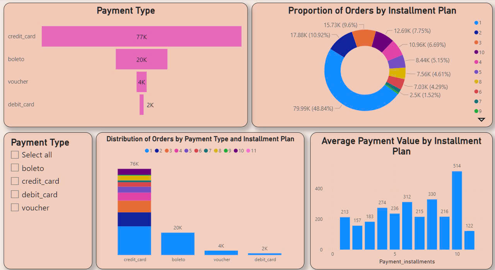

#  E-commerce Company
## Introduction
In this project, I am analyzing the **Brazilian E-Commerce dataset**, generously provided by **Olist**, the largest department store in Brazilian marketplaces. Olist connects small businesses across Brazil with sales channels, allowing them to sell their products through the **Olist Store** and ship directly to customers using **Olist logistics partners**. The dataset contains information on **100k orders** made between **2016 and 2018** at multiple marketplaces in Brazil.

The dataset offers insights into various aspects of e-commerce, including **order status**, **pricing**, **payment methods**, and **delivery performance**, as well as **customer location**, **product attributes**, and **customer reviews**. 

The goal of this analysis is to explore **overall performance**, **product trends**, **order patterns**, **customer satisfaction**, and **transaction data** to provide valuable insights into the dynamics of Brazil's e-commerce market.

For this project, I am using **Python** for data processing, analysis, and visualization, and **Power BI** for creating **interactive reports** and **dashboards** to present the findings and insights from the **Brazilian E-Commerce dataset**.

Here are the datasets I am using for the project:

### ✔ Orders dataset
Provide information about orders
- order_id: unique ID of the order
- customer_id: unique ID of the customer
- order_status: order status
- order_purchase_timestamp: time when the order was ordered
- order_approved_at: time the order is approved
- order_delivered_carrier_date: the time the item was delivered to the carrier
- order_delivered_customer_date: the time the item was delivered to the customer
- order_estimated_delivery_date: the estimated time the order will be delivered to the customer

### ✔ Order items dataset  
Provide information about each item in the order and shipping costs
- order_id: unique ID of the order
- order_item_id: ID of the item in the order (item number 1 has ID 1, item 2 has ID 2, etc. Based on this we also know how many items each order has)
- product_id: unique ID of the product in the order
- seller_id: unique ID of the seller
- price: the price of the item
- freight_value: shipping fee

### ✔ Order payments dataset
Provide information about order payments.
- order_id: unique ID of order
- payment_sequential: sequence order
- payment_type: payment type
- payment_installments: full payment (payment_installments = 1) or installment (payment_installments > 1,total payment is splited to many payments .
- payment_value: payment value (payment_value - equal total payments of all times payment installments)

### ✔ Product dataset 
Provide product information
- product_id: unique ID of product
- product_category_name: category product name 
- product_name_lenght: number of product name letters
- product_description_lenght: number of product description letters
- product_photos_qty: number of product photo
- product_weight_g: weight of product  (g)
- product_length_cm: length of product (cm)
- product_height_cm: height of product (cm)
- product_width_cm: width/deep of product (cm)

### ✔ Product category name translation
Translate the product name from Portuguese to English

- product_category_name
- product_category_name_english

### ✔ Order reviews dataset 
Provide review details of each order
- review_id: unique ID of review
- order_id: unique ID of order
- review_score: Review Score
- review_comment_title: Comment title
- review_comment_message: detail of review
- review_creation_date: Created date of review
- review_answer_timestamp: timestamp of review answers

### ✔ Customers dataset
Provide Customer Information 

- customer_id: customer unique ID ( used to link with customer_id of orders_dataset table.
- customer_unique_id: mã unique ID of customer in system of customer information management. 
- customer_zip_code_prefix: zip code of customer
- customer_city: City name of customer 
- customer_state: State name of customer

# Analysis
## 1. Overall 

### Performance and Customer Engagement
With about **100,000 orders** by Brazilians, there are **135K products purchased**, revealing the marketplace's wide variety of items.

The **40M Brazilian Real in revenue** highlights a thriving e-commerce platform, reflecting the **growing acceptance of online shopping** in Brazil, especially during the **2016-2018** period.

The **4.02 review score** indicates that while customers are generally satisfied with their purchases, there is room for improvement. The relatively high number of **48K comments** shows that customers are actively engaging with the platform, providing feedback that can be used to enhance **customer experience, product offerings**, and **services**.

### Geographical Insights
Analyzing the top five states by order volume, **São Paulo** stands out with **17K orders**, reflecting the state's **larger population** and **economic activity**. The dominance of **São Paulo** and **Rio de Janeiro** suggests these areas are the **primary consumer markets for Olist**, likely due to **higher disposable income** and a **more developed logistics network**.

Conversely, the **bottom five states** (RO, AM, AC, AP, and RR) show a much lower volume of orders. These states, typically **less populated** and **geographically more isolated**, present challenges in reaching consumers.

### Product Trends
The **top-selling product categories** such as **Bed, Bath & Table**, **Furniture & Decor**, and **Health & Beauty** dominate the sales figures. This suggests that Brazilian consumers are investing in **home goods** and **personal care products**.

### Sales Trends Over Time
The **sales over time graph** showcases an **upward trend**, particularly from **mid-2017 to 2018**, where sales consistently surpass **6K products per month**. This growth aligns with the overall **expansion of the e-commerce sector** in Brazil during that period, driven by **increased internet penetration**, **improved mobile access**, and **changing consumer shopping habits**.

The **peaks in 2017 and 2018** suggest **seasonal spikes**, likely driven by **promotions, holiday sales**, or **key retail events**.

## 2. Sale and Product

### Top-Selling Product Categories

The category **Bed, Bath & Table** leads with **13.7K products sold**, generating a total revenue of **1.04M Brazilian Real**, reflecting its popularity and significant contribution to overall sales.

Following closely, **Furniture & Decor** recorded **11.5K sales**, yielding **0.73M Brazilian Real**, showing consistent demand for home-related products. Despite ranking second in sales, it generates relatively lower revenue, possibly due to lower price points or frequent discounts.

**Health & Beauty** achieved **1.26M Brazilian Real** in revenue from **11.1K units sold**, marking it as the most lucrative category despite being third in volume, likely due to higher average product prices. While Health & Beauty ranks third in sales volume, its **1.26M revenue** demonstrates that consumers are willing to pay more for these products, indicating a focus on quality or premium offerings.

**Sports & Leisure** and **Computers & Accessories** also performed well, each contributing **9.9K units sold**, with revenue of **0.99M** and **0.91M Brazilian Real**, respectively, showcasing a balanced product portfolio.

### Monthly Trends

The Top 4 Product Categories (**Bed, Bath & Table**, **Furniture & Decor**, **Health & Beauty**, **Sports & Leisure**) exhibit consistent sales throughout the year.

Peaks are observed in **November** and **December**, likely driven by holiday seasons, sales promotions, and heightened consumer spending, especially for Health & Beauty and Bed, Bath & Table categories.

### Geographical Sales Distribution

The treemap highlights **São Paulo (SP)** as the leading state, contributing **14.67M Brazilian Real**, emphasizing its role as the primary consumer market.

Other significant contributors include **Rio de Janeiro (RJ)** with **5.48M** and **Minas Gerais (MG)** with **3.96M**.

### Insights
The dominance of home goods, personal care, and leisure products suggests consumer focus on lifestyle and well-being. Targeted marketing for premium products in high-revenue categories like **Health & Beauty** and leveraging seasonal sales spikes could further optimize revenue potential.

## 3. Orders

### **Total Orders**:

The total number of orders is **96K**, with **99.99%** of those orders being successfully delivered and only **0.01%** canceled.

The very low cancellation rate reflects a stable system in terms of order completion and customer satisfaction.

### **Late Orders**:

The "**Total Late Orders**" graph displays the trend of delayed orders over time. We can observe periodic peaks in late orders, particularly in **2017** and **2018**, where some months had significantly more late orders compared to others.

For example, **November 2017** shows a notable spike of **904 late orders**, followed by peaks in **March 2018 (1328 late orders)** and **May 2018 (443 late orders)**.

These fluctuations could be tied to specific periods such as holiday seasons, which often have higher order volumes, and operational issues that delayed delivery.

### **State-Based Delivery Time**:

The "**Average Delivery Time by State**" chart highlights that **RR** has the highest average delivery time (**29 days**), followed by **AP (27 days)** and **AM (26 days)**.

This suggests that deliveries in some states are consistently taking longer than others, possibly due to factors such as infrastructure challenges, distance, or logistics inefficiencies.

### **Geographical Distribution of Orders**:

The "**Total Orders by State**" shows that **São Paulo (SP)** has the highest number of orders with **40.5K** orders, followed by **Minas Gerais (MG)** with **12.35K** and **Rio de Janeiro (RJ)** with **11.36K**.

These states are major consumer hubs in Brazil, explaining their high order counts. Understanding this distribution helps in focusing operational resources in key markets.

### **Insights**:

The **high number of late orders** in specific months could indicate a need to improve **logistical efficiency**, especially during **peak periods**. 

The **longer delivery times** in some states suggest potential areas for improvement in **regional logistics** or **delivery networks**.  

**São Paulo**, being the highest in order volume, could be **a key focus** for improving **customer experience** and addressing **late deliveries**.

## 4. Customer Transaction

### **Payment Type**:

- Credit card is the most popular payment method, with 77K orders.

- Boleto ranks second, with 20K orders.

- Less frequently used methods include voucher (4K orders) and debit card (2K orders).

This indicates that customers primarily prefer credit card payments over other methods.

### **Proportion of Orders by Installment Plan**:

- 48.84% of orders (79.99K) were paid in full with a single payment (no installment).

- 2 installments (17.88K - 10.92%).

- 3 installments (15.73K - 9.6%).

- The proportion of orders decreases as the number of installments increases.

Single payments dominate, indicating that most customers prefer to pay directly without using installment plans.

### **Distribution of Orders by Payment Type and Installment Plan**:

- Credit card is the only method used for multiple installment plans (ranging from 1 to 11 installments).

- Boleto, voucher, and debit card are mostly used for single payments.

This demonstrates the flexibility of credit cards in supporting installment plans.

### **Average Payment Value by Installment Plan**:

- The highest average payment value (514) is observed in orders with 10 installments.

- For plans with 1 to 9 installments, the average payment value ranges from 157 to 330.

This suggests that high-value orders are more likely to utilize installment plans with more payments.

### **Insight**:

**Primary Payment Method:** Credit cards are the preferred choice due to their flexibility with installment plans, whereas boleto and voucher are primarily used for single payments.

**Installment Plans:** Most customers opt for single payments, but high-value transactions tend to favor longer installment plans, especially those with 10 payments.

**Improvement Strategy:**

- Encourage the use of installment plans for high-value transactions via methods like voucher or debit card.

- Offer incentives for customers using boleto to diversify payment methods.

## 5. Customer Satisfaction

